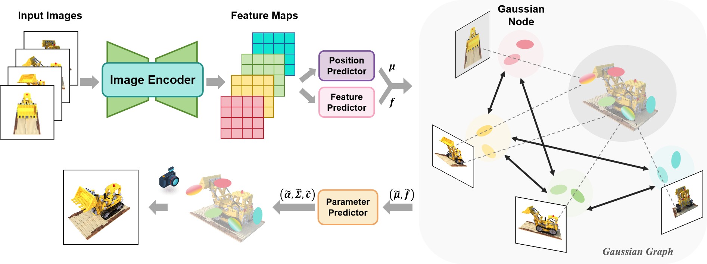

# Gaussian Graph Network

Official implementation of Gaussian Graph Network: Learning Efficient and Generatlizable Gaussian Representations from Multi-view Images

[Shengjun Zhang](https://shengjun-zhang.github.io/) Xin Fei, Fangfu Liu, Haixu Song, Yueqi Duan.

<p align="center">
    
</p>

## Installation

To get started, create a conda virtual environment using Python 3.10+ and install the requirements:

```bash
conda create -n mvsplat python=3.10
conda activate mvsplat
pip install torch==2.1.2 torchvision==0.16.2 torchaudio==2.1.2 --index-url https://download.pytorch.org/whl/cu118
pip install -r requirements.txt
```

## Acquiring Datasets

### RealEstate10K and ACID

We follow the instructions of [pixelSplat](https://github.com/dcharatan/pixelsplat) and [MVSplat](https://github.com/donydchen/mvsplat) to preprocess datasets.

pixelSplat was trained using versions of the RealEstate10k and ACID datasets that were split into ~100 MB chunks for use on server cluster file systems. Small subsets of the RealEstate10k and ACID datasets in this format can be found [here](https://drive.google.com/drive/folders/1joiezNCyQK2BvWMnfwHJpm2V77c7iYGe?usp=sharing). To use them, simply unzip them into a newly created `datasets` folder in the project root directory.

If you would like to convert downloaded versions of the RealEstate10k and ACID datasets to our format, you can use the [scripts here](https://github.com/dcharatan/real_estate_10k_tools).

### DTU 

Download the preprocessed DTU data [dtu_training.rar](https://drive.google.com/file/d/1eDjh-_bxKKnEuz5h-HXS7EDJn59clx6V/view).

Convert DTU to chunks by running `python src/scripts/convert_dtu.py --input_dir PATH_TO_DTU --output_dir datasets/dtu`


## Running the Code

### Evaluation

Get the [pretrained models](https://drive.google.com/drive/folders/1UPZ16yOLVzqMWb62G_5LaCgzw1ZlWXTP), and save them to `/checkpoints`. Run the following:

```bash
# re10k
python -m src.main +experiment=re10k \
checkpointing.load=checkpoint/re10k.ckpt \
mode=test \
dataset/view_sampler=evaluation \
test.compute_scores=true \
dataset.view_sampler.index_path=assets/re10k_4view.json

# acid
python -m src.main +experiment=acid \
checkpointing.load=checkpoint/acid \
mode=test \
dataset/view_sampler=evaluation \
test.compute_scores=true \
dataset.view_sampler.index_path=assets/acid_4view.json 
```

To render videos from a pretrained model, run the following

```bash
# re10k
python -m src.main +experiment=re10k \
checkpointing.load=checkpont/re10k \
mode=test \
dataset/view_sampler=evaluation \
dataset.view_sampler.index_path=assets/evaluation_index_re10k_video.json \
test.save_video=true \
test.save_image=false \
test.compute_scores=false
```

### Training

Get the [initialized models](https://drive.google.com/drive/folders/1UPZ16yOLVzqMWb62G_5LaCgzw1ZlWXTP), and save them to `/checkpoints`. Run the following:

```bash
# re10k
python -m src.main +experiment=re10k data_loader.train.batch_size=6 checkpointing.load=checkpoints/re10k_init.ckpt
# acid
python -m src.main +experiment=acid data_loader.train.batch_size=6 checkpointing.load=checkpoints/acid_init.ckpt
```

## BibTeX

```bibtex
@article{zhang2024GGN,
    title   = {Gaussian Graph Network: Learning Efficient and Generatlizable Gaussian Representations from Multi-view Images},
    author  = {Shengjun Zhang, Xin Fei, Fangfu Liu, Haixu Song, YueqiDuan},
    journal = {Advances in Neural Information Processing Systems (NeurIPS)},
    year    = {2024},
}
```

## Acknowledgements

The project is largely based on [pixelSplat](https://github.com/dcharatan/pixelsplat) and [MVSplat](https://github.com/donydchen/mvsplat). Many thanks to these two projects for their excellent contributions!
